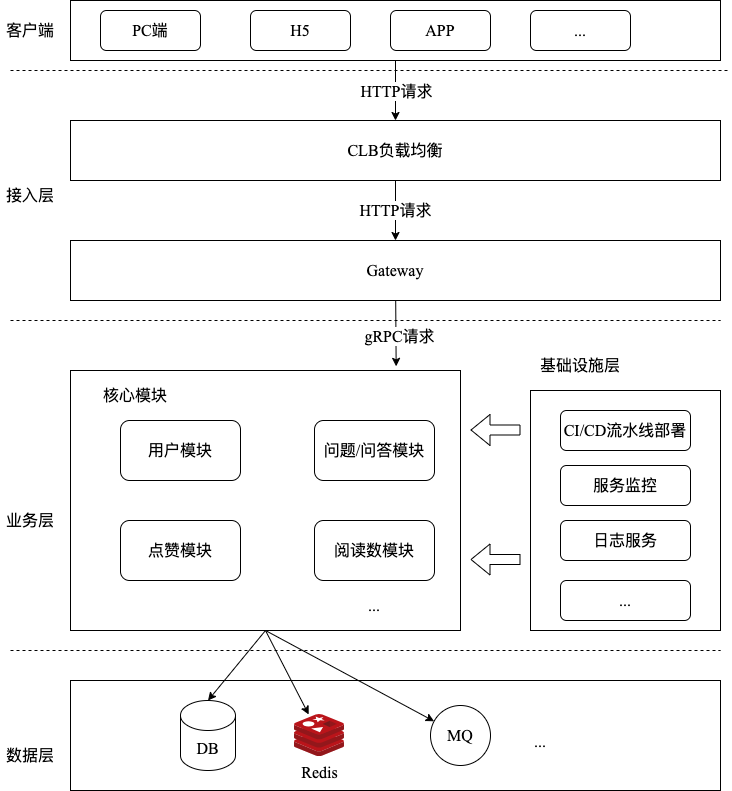

# 架构设计

整个系统架构的分层分为客户端、接入层、服务层、数据
层、基础设施层。其中每个层所做的事情如下：
- 客户端：用户请求的来源主要分为 PC 端、H5、APP 以及其他类型的客户端。
- 接入层：CLB 负责负载均衡(例如：腾讯云、阿里云的 CLB），gateway 用于
接收外部 http 请求和调用上游 gRPC 微服务所提供的接口。
- 服务层：负责核心模块的业务逻辑编排，以微服务的形式对外提供服务。
- 数据层：负责整个系统的数据持久化存储（MySQL）和业务数据缓存处理
（Redis）。
- 基础设施层：负责整个系统 CI/CD、服务监控、日志服务、链路追踪等。
