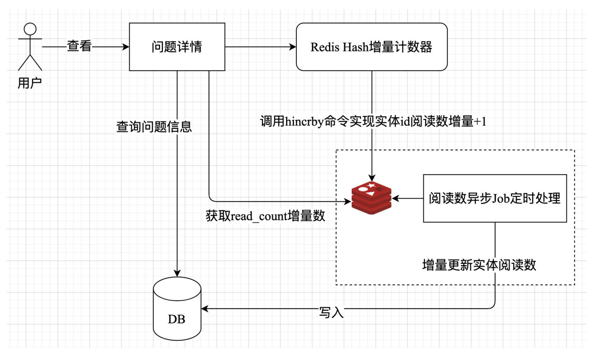

# 使用 Redis 计数器实现问题阅读数功能
整体架构：


当用户查看问题详情时，服务端首先从数据库表中查询问
题基本信息，并通过 Redis Hash hincrby 命令将问题实体的阅读数增量+1，然后立即返回问题当前阅读数。
与此同时，在服务端通过一个异步 Job 从 Redis 中获取问题实体的阅读数增量，并将其写入数据库表中。

问题实体阅读数和增量同步阅读数两个操作封装为一个
ReadCountRepo trait，其核心代码如下：
```rust
// qa-svc/src/domain/repository/entity_read_count.rs 文件
use crate::domain::entity::EntityReadCountData;

// 通过async_trait宏标记定义异步方法
#[async_trait::async_trait]
pub trait ReadCountRepo: Send + Sync + 'static {
    // 增加实体阅读数
    // 每个实体的阅读数通过redis hash incr计数器方式实现
    async fn incr(&self, data: &EntityReadCountData) -> anyhow::Result<u64>;

    // 处理每个实体的阅读数
    // 可以根据实际情况写入db表中或别的地方持久化存储
    async fn handler(&self, target_type: &str) -> anyhow::Result<()>;
}
```

EntityReadCountData 类型，表示点赞所需的
基本信息，它是一个结构体类型，其定义如下：
```rust
// 实体阅读数对应的基本数据信息
#[derive(Debug, Default)]
pub struct EntityReadCountData {
    pub target_id: u64,      // 实体id
    pub target_type: String, // 实体类型
    pub count: u64,          // 增量阅读数
}
```
incr 方法的返回值是一个 anyhow::Result<u64>类型，它是一个 Result 类型，来自第三方库 anyhow，其底层源码定义如下：
```rust
pub type Result<T, E = Error> = core::result::Result<T, E>;
```
从 `Result` 类型别名可以看出，如果操作成功就返回 T，否则返回对应的 E。这个`Error` 是一个动态错误类型的包装器，就如 `Box<dyn std::error::Error>`一样，几乎可以
容纳任何错误类型。
也就是说，`incr` 方法所对应的具体数据类型在实现过程中，如果发生错误，都可以将错误放入 E 中。这里需要强调一点，`Error` 要求具体的 `error` 数据
类型必须满足 `Send`、`Sync trait` 以及满足`'static` 生命周期。也就是说，这个 Error 可以在线程之间转移所有权，同时它也可以在线程之间安全共享（在使用的上下文作用范围内一直有效）。

除此之外，这个 Error 是可以回溯到最底层的错误是什么样的数据类型，并且它是一个 narrow pointer 指针类型。换句话说，Error 是一个窄指针，使用
一个字长大小表示错误，而不是两个字长大小。

`ReadCountRepo` 中的 handler 方法第一个参数同样也是&self，第二个参数
target_type 是一个&str 类型，表示具体的实体类型。该方法返回值 `anyhow::Result<()>`类型，如果在处理增量阅读数的过程，操作成功就返回()空元组类型，否则失败返回具体的 `anyhow::Error` 类型。

让我们先打开一个命令终端切换到 `crates/qa-svc` 目录中执行 `cargo run --bin qa-svc` 命令启动 qa-svc 服务

再新开一个命令终端切换到 `crates/qa-svc` 目录中执行 `cargo run --bin qa-read_count-job` 命令启动 Job（用于实时处理问题阅读数增量更新）。

安装 grpcurl 工具
```shell
go install github.com/fullstorydev/grpcurl/cmd/grpcurl@latest
```

随后，新开一个终端并依次运行如下 grpcurl 命令（grpcurl 工具安装和基本使用，见附录 E1.3）创建用户、添加问题以及查看问题详情等接口
```shell
# 注册用户
grpcurl -d '{"username":"daheige","password":"123456"}' -plaintext 127.0.0.1:50051 qa.QAService.UserRegister

# 注册用户
grpcurl -d '{"username":"xiaoming","password":"123456"}' -plaintext 127.0.0.1:50051 qa.QAService.UserRegister

# 用户登录
grpcurl -d '{"username":"daheige","password":"123456"}' -plaintext 127.0.0.1:50051 qa.QAService.UserLogin

# 用户退出
grpcurl -d '{"token":"xxx"}' -plaintext 127.0.0.1:50051 qa.QAService.UserLogout

# 发表问题
grpcurl -d '{"title":"rust 实战","created_by":"daheige","content":"qa 微服务"}' -plaintext 127.0.0.1:50051 qa.QAService.AddQuestion

# 查看问题明细
grpcurl -d '{"id":1,"username":"daheige"}' -plaintext 127.0.0.1:50051 qa.QAService.QuestionDetail
```

当我们通过 grpcurl 请求问题详情时，就会返回当前问题
的阅读数。此时，阅读数 Job 就会实时从 Redis Hash 计数器中读取问题阅读数增量，并将其同步到数据库表 questions 表中。
