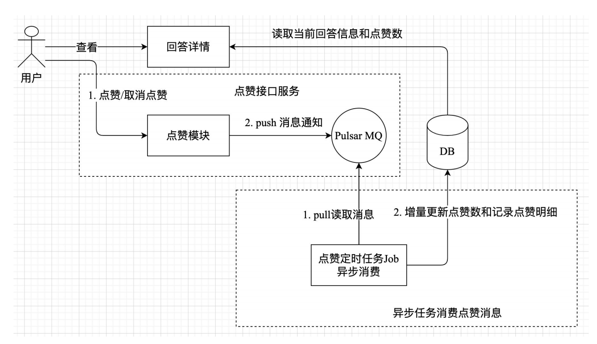

# 使用 Pulsar 实现回答点赞功能
整体架构：


为了实现点赞功能，我将上述操作抽象为一个 UserVoteRepo trait，核心代码如下
所示：
```rust
// qa-svc/src/domain/repository/vote.rs 文件
// 通过async_trait宏标记定义异步方法
#[async_trait::async_trait]
pub trait UserVoteRepo: Send + Sync + 'static {
    // 判断用户是否对某个实体对象已点赞
    async fn is_voted(
        &self,
        target_id: u64,
        target_type: &str,
        username: &str,
    ) -> anyhow::Result<bool>;

    // 判断用户对一批实体对象是否已点赞
    async fn is_batch_voted(
        &self,
        target_id: &Vec<u64>,
        target_type: &str,
        username: &str,
    ) -> anyhow::Result<HashMap<u64, bool>>;

    // 发送用户点赞消息
    async fn publish(&self, msg: VoteMessage) -> anyhow::Result<bool>;

    // 根据实体类型异步消费用户点赞消息，实现点赞数增量更新和记录点赞明细
    async fn consumer(&self, target_type: &str, exit: Arc<RwLock<bool>>) -> anyhow::Result<()>;
}
```
`UserVoteRepo` trait 主要有 `is_voted`（单个回答当前用户是否点赞）、`is_batch_voted`（用在回答列表当前用户是否点赞）、`publish`（发送点赞和取消点赞消息通知）、`、consumer`（消费消息）等方法。这些方法中的target_id和target_type
参数分别表示实体 id 和实体类型。
`publish`方法的第二个参数是一个 `VoteMessage` 结构体类型，其定义和剖析见 `qa-svc/vote_message.md` 文件。上述 `UserVoteRepo` trait 的具体技术实现见 `qa-svc/user_vote.md` 文件。

为了验证回答点赞功能，首先执行如下 grpcurl 命令创建一个回答：
```shell
grpcurl -d '{"answer":{"question_id":1,"created_by":"daheige","content":"hello，rust 实战"}}' -plaintext 127.0.0.1:50051 qa.QAService.AddAnswer
```

然后，启动点赞job `qa-vote-job`
执行 `cargo run --bin qa-vote-job` 命令启动点赞定时任务 Job。

接着，新开一个命令终端并执行如下 grpcurl 命令请求回答点赞和取消点赞接口
```shell
grpcurl -d '{"id":1,"created_by":"daheige","action":"up"}' -plaintext 127.0.0.1:50051 qa.QAService.AnswerAgree

grpcurl -d '{"id":1,"created_by":"daheige","action":"cancel"}' -plaintext 127.0.0.1:50051 qa.QAService.AnswerAgree
```

当用户请求点赞和取消点赞操作时，qa-vote-job 就会实
时将当前回答的点赞增量数更新到 anwers 数据表中。
