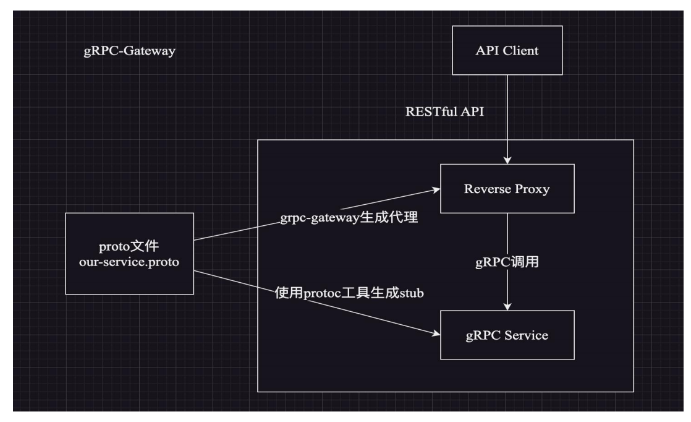

# gRPC HTTP 网关层
gRPC-Gateway 主要作用在于它允许开发者同时提供 gRPC 客户端和 HTTP JSON 格式的 API，这对需要同时支持这两种通信协议的应用来说非常有用。此外，它还支持多种端实现方式，包含 gRPC、OpenAPI/Swagger 文档和自定义 HTTP 后端服务，



本小节中提到的 gRPC HTTP 网关层，实际上是一个将 HTTP 请求的 JSON 数据格式转换为 pb Message 数据类型，并调用 gRPC 服务的 Web Server

接下来，我将通过 Axum 框架和 gRPC Client Proxy
演示如何在该 QA 系统中接入 gRPC HTTP 网关层。
qa-project/crates/gateway/src/main.rs
```rust
// 自定义模块
mod config;
mod handlers;
mod middleware;
mod routers;
mod utils;

// 引入Config
use config::{AppState, APP_CONFIG};
use infras::{graceful_shutdown, prometheus_init, Logger};

use log::info;
use pb::qa::qa_service_client::QaServiceClient;
use std::net::SocketAddr;
use std::process;
use std::sync::Arc;
use std::time::Duration;
use tokio::net::TcpListener;

#[tokio::main]
async fn main() {
    // 如果想在启动时改变日志级别，可以通过指定环境变量启动应用
    // 日志level 优先级  error > warn > info > debug > trace
    // 启动方式：RUST_LOG=debug cargo run --bin gateway
    // std::env::set_var("RUST_LOG", "debug");
    Logger::new().init(); // 使用默认方式初始化日志配置

    info!("qa gateway start...");

    // 开发过程中，可以取消下面的注释
    if APP_CONFIG.app_debug {
        println!("conf:{:?}", APP_CONFIG);
    }

    // build http /metrics endpoint
    let metrics_server = prometheus_init(APP_CONFIG.metrics_port);
    let metrics_handler = tokio::spawn(metrics_server);

    // http gateway handler
    let gateway_handler = tokio::spawn(async move {
        // Create grpc client
        let grpc_client = QaServiceClient::connect(APP_CONFIG.grpc_address.as_str())
            .await
            .expect("failed to connect grpc service");

        // 通过Arc原子引用的方式传递state
        let app_state = Arc::new(AppState { grpc_client });

        let address: SocketAddr = format!("0.0.0.0:{}", APP_CONFIG.app_port).parse().unwrap();
        println!("current process pid:{}", process::id());
        println!("http gateway run on:{}", address.to_string());

        // Create axum router
        let router = routers::router::api_router(app_state);

        // Create a `TcpListener` using tokio.
        let listener = TcpListener::bind(address).await.unwrap();

        // Run the server with graceful shutdown
        axum::serve(listener, router)
            .with_graceful_shutdown(graceful_shutdown(Duration::from_secs(
                APP_CONFIG.graceful_wait_time,
            )))
            .await
            .expect("failed to start gateway service");
    });

    // start http gateway and metrics service
    let _ = tokio::try_join!(gateway_handler, metrics_handler)
        .expect("failed to start http gateway and metrics service");
}
```

为了启动该 gRPC HTTP 服务，我们需要在 `qa-project/crates/gateway` 目录下新增 `app-gw.yaml` 文件
```yaml
app_debug: false # 是否开启调试模式
app_port: 8090 # http gateway port
metrics_port: 1338 # prometheus metrics port
grpc_address: http://127.0.0.1:50051 # grpc service运行端口
graceful_wait_time: 3 # http service平滑退出等待时间，单位s
```
切换到 `qa-project/crates/gateway` 目录中执行 `cargo run --bin gateway` 命令启动 gateway 服务

gRPC Gateway 服务运行在 8090 端口上面
们使用 postman 软件通过 POST 请求 `localhost:8090/api/user/login` 接口（该接口对应 proto/qa.proto 文件中的 qa.QAService.UserLogin 方法）

```json
{"username":"daheige","password":"123456"}
```
