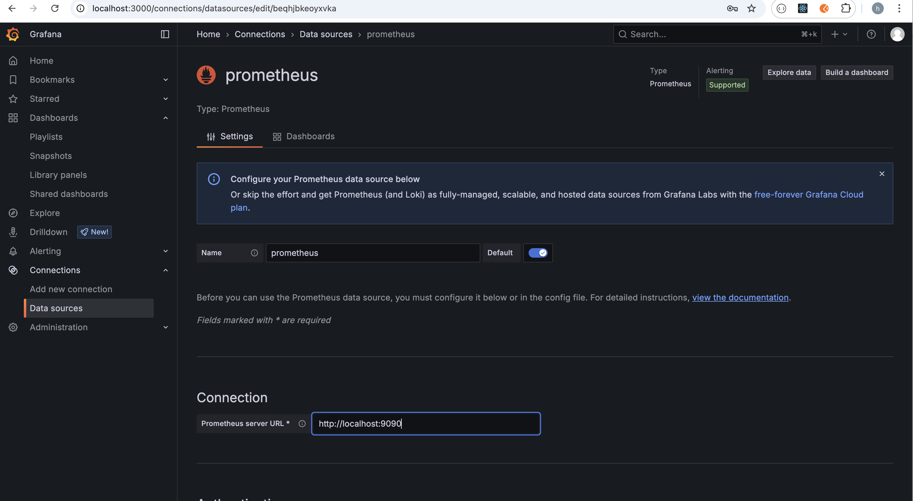

# grafana 部署与接入
https://grafana.com/docs/grafana/latest/setup-grafana/installation/

当安装好 grafana 软件后，首先在浏览器中访问 `http://localhost:3000` 输入用户名和密码（用户名和密码默认都是 admin，我们可以根据实际情况进行更改密码）进入grafana UI 界面。

首先，在左边菜单栏中找到“Home > Connections > Data sourcesData sources”按钮后，然后点击“Add data source”按钮，并在右
侧界面中选择 prometheus 数据源，输入 prometheus 服务地址（默认值是 localhost:9090，在实际项目中可以根据实际情况更改）。

接着点击下面的“Build a dashboard”按钮创建一个 dashboard面板。

随后，我们再点击“Add visualization”按钮并选择 prometheus data sources。此时，我们可以选择 Metric 相对应的指标，并点击右边的“Run queries”按钮获取对应的 metrics 数据指标。最后，点击右上方的“Apply” 按钮生效。
