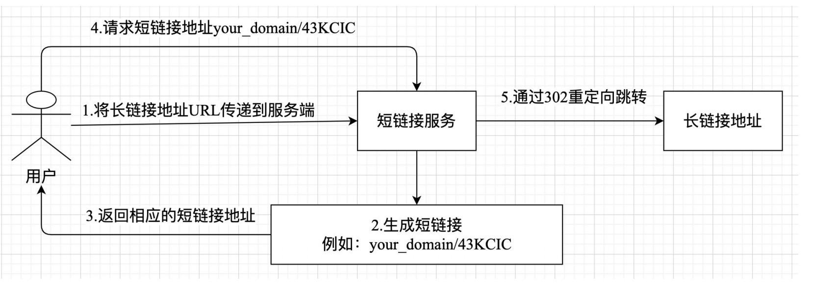

# 编写一个简单的短链服务
## 架构设计


该短链服务的功能是将原始较长的 URL 地址转换为较短
且唯一的 URL 地址，例如：your_domain/43KCIC。当用户请求这个短链接地址时，
服务端将会解析并查询该短链接对应的长链接地址。如果匹配长链接地址成功，程序
将 302 重定向跳转到原始的长链接地址上面去。

## 创建项目
```shell
cargo new short-url
```

## 相关依赖
```ini
# murmurhash和base62用于生成短链字符串
murmurhash32 = "0.3.1"
base62 = "2.0.3"

# web框架的相关依赖
axum = "0.7.9"
serde = { version = "1.0.215", features = ["derive"] }
serde_json = "1.0.133"
tokio = { version = "1.42.0", features = ["full"] }
```

# 代码实现
main.rs
```rust
// 引入axum包
use axum::{
    routing::{get, post},
    Router,
};
use std::net::SocketAddr;
use std::process;
use std::sync::Arc;

// 定义处理器函数对应的模块
mod handlers;

#[tokio::main]
async fn main() {
    // HTTP服务运行地址
    let address = "127.0.0.1:8080";
    println!("server run on:{}", address);
    println!("server pid:{}", process::id()); // 服务启动的进程id

    // with_state 共享数据
    let shared_state = Arc::new(handlers::AppState::default());
    // 创建axum router
    let router = Router::new()
        .route("/:key", get(handlers::short_url))
        .route("/create-short-url", post(handlers::create_short_url))
        .with_state(shared_state) // 通过with_state方式传递共享数据shared_state
        .fallback(handlers::not_found_handler);

    // 创建一个listener对象
    let addr: SocketAddr = address.parse().unwrap();
    let listener = tokio::net::TcpListener::bind(addr).await.unwrap();

    // 启动HTTP服务
    axum::serve(listener, router)
        .with_graceful_shutdown(handlers::graceful_shutdown()) // 设置平滑退出函数
        .await
        .unwrap();
}
```
hanlders.rs
```rust
use axum::{
    extract::Path,
    extract::State,
    http::StatusCode,
    response::{IntoResponse, Redirect, Response},
    Json,
};

use serde::{Deserialize, Serialize};
use std::time::Duration;
use tokio::signal; // 用于signal平滑退出

use std::collections::HashMap;
use std::sync::{Arc, RwLock};

// 定义空对象{}数据类型
#[derive(Deserialize, Serialize, Debug)]
pub struct EmptyObject {}

// short_url函数，根据短链接url获取原始的长url
// eg:your_domain/43KClC 格式的短链请求
pub async fn short_url(Path(key): Path<String>, State(state): State<Arc<AppState>>) -> Response {
    println!("request short url:{}", key);
    // 解析base62字符串为murmurhash32值为u128类型
    let res = base62::decode(key);
    if res.is_err() {
        return (
            StatusCode::OK,
            Json(Reply::<EmptyObject> {
                code: 0,
                message: "short url invalid".to_string(),
                data: None,
            }),
        )
            .into_response();
    }

    // 从AppState db中读取key对应的原始地址url
    let key = res.unwrap().to_string();
    let db = &state.db.read().unwrap();
    if let Some(origin_url) = db.get(&key) {
        // 跳转到对应的原始地址
        Redirect::to(origin_url).into_response()
    } else {
        return (
            StatusCode::NOT_FOUND,
            Json(Reply::<EmptyObject> {
                code: 0,
                message: "short url not found".to_string(),
                data: None,
            }),
        )
            .into_response();
    }
}

#[derive(Deserialize, Serialize, Debug)]
pub struct Reply<T> {
    pub code: i32,
    pub message: String,
    pub data: Option<T>,
}

// ShortUrlEntity 创建短链接的实体对象
#[derive(Serialize, Deserialize, Debug)]
pub struct ShortUrlRequest {
    url: String,
}

// 短链接返回结果
#[derive(Serialize, Deserialize, Debug)]
pub struct ShortUrlReply {
    short_url: String,
}

// 为了模拟存储，这里采用hash map结构存储短链接murmurhash32值对应的字符串和原始地址映射关系
#[derive(Default)]
pub struct AppState {
    // hash map使用RwLock读写锁，然后使用Arc原子计数包装一下，可以跨线程共享读写数据
    db: Arc<RwLock<HashMap<String, String>>>,
}

// 接收body请求生成对应的短链接地址url
// 创建短链接url
pub async fn create_short_url(
    State(state): State<Arc<AppState>>,
    Json(payload): Json<ShortUrlRequest>,
) -> impl IntoResponse {
    println!("request origin url:{}", payload.url);

    // murmurhash算法生成出来的数字是u32类型的，重复的概率非常小
    // 如果有重复在实际业务中,可以在url后面追加随机字符串方式处理或者采用mysql唯一索引的方式处理
    let num = murmurhash32::murmurhash3(payload.url.as_bytes());
    let key = num.to_string();
    println!("murmurhash32 key:{}", key);
    let mut db = state.db.write().unwrap();
    db.insert(key, payload.url);

    let flag = base62::encode(num);
    let domain = "localhost:8080"; // 根据实际情况改成你的domain地址
    let short_url = format!("{}/{}", domain, flag);
    let reply = ShortUrlReply { short_url };
    (
        StatusCode::OK,
        Json(Reply {
            code: 0,
            message: "ok".to_string(),
            data: Some(reply),
        }),
    )
}

// handler not found for global router not found
pub async fn not_found_handler() -> impl IntoResponse {
    (StatusCode::NOT_FOUND, "this page not found")
}

// graceful shutdown
pub async fn graceful_shutdown() {
    let ctrl_c = async {
        signal::ctrl_c()
            .await
            .expect("failed to install ctrl+c handler");
    };

    #[cfg(unix)]
    let terminate = async {
        signal::unix::signal(signal::unix::SignalKind::terminate())
            .expect("failed to install signal handler")
            .recv()
            .await;
    };

    let graceful_wait_time = Duration::from_secs(5);
    #[cfg(not(unix))]
    let terminate = std::future::pending::<()>();
    tokio::select! {
        _ = ctrl_c =>{
            println!("received ctrl_c signal,server will exist...");
            tokio::time::sleep(graceful_wait_time).await;
        },
        _ = terminate => {
            println!("received terminate signal,server will exist...");
            tokio::time::sleep(graceful_wait_time).await;
        },
    }

    println!("signal received,starting graceful shutdown");
}
```
