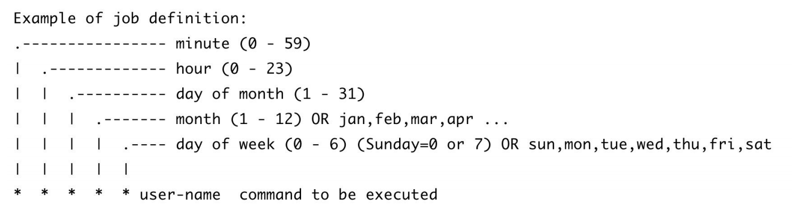

# crontab 基本语法
crontab（cron table 的缩写）是一个在 Linux 和 Unix 操作系统上用于定时执行任
务的工具。它允许用户创建和管理计划任务，以便在特定的时间间隔或时间点自动运
行命令或脚本。

格式：* * * * * user-name command to be executed

crontab 命令每一列的具体含义如下：
- 第 1 列单位为分，表示每时第几分钟，范围为 0-59。
- 第 2 列单位为时，表示每天第几小时，范围为 0-23。
- 第 3 列单位为日，表示每月第几天，范围为 1-31。
- 第 4 列单位为月，表示每年第几月，范围为 1-12。
- 第 5 列单位为星期，表示每星期第几天，范围为 0-7，其中 0 与 7 表示星期
日，其他分别为星期一到星期六。
- 第 6 列表示需要执行的命令，用来定义需要执行的命令或脚本，它紧跟在时
间字段后面，并且以换行符或分号分割。

除此之外，crontab 命令从第 1 列到第 5 列中还有一些特殊字符用于表示一些特殊
的含义，以便更灵活地定义任务的执行时间规则。这些特殊字符所代表的含义如下：
- 星号（*）：表示通配符，代表任意值。当某个时间字段使用星号时，表示
该字段的取值范围是不限制的，即每分钟、每小时、每天、每月或每周都执
行任务。
- 逗号（,）：表示枚举，可以指定多个值。用逗号将多个取值分隔开，表示任
务在这些值对应的时间点执行。
- 中线（-）：表示范围，可以指定一个范围内的值。用中线将两个值连接起来，
表示任务在这个范围内的所有时间点执行。
- 斜杠（/）：表示步长，用于指定时间的间隔。在时间字段后面加斜杠和一个
数字，表示以指定的间隔执行任务。例如：*/5 表示每隔 5 单位时间执行一
次任务。

通过crontab -e 打开 crontab 任务编辑，添加如下命令配置：
*/1 * * * * date >> /tmp/time.log

运行 tail -f /tmp/time.log 命令等待几分钟，终端就会输出当前
时间

crontab 命令常用的选项，如下所示：
- -e 选项：表示打开当前用户的 crontab 任务列表配置文件。当然你也可以直
接打开。在 Linux 系统下，crontab 配置文件的路径通常在/var/spool/cron/下，
文件以用户名命名，例如：/var/spool/cron/root。同时，crontab 的-e 选项可以
帮我们自动检查任务配置是否符合规则。
- -u 选项：为某个用户添加 crontab 定时任务。例如：root 用户可通过 crontab
-u xiaoming -e 命令切换到 xiaoming 用户添加 crontab 定时任务。
- -l 选项：列出某个用户的所有任务列表。
- -r 选项：删除某个用户所有 crontab 命令。执行该操作需要特别谨慎，防止
发生异常情况。
关于 crontab 命令的选项中，主要是以上几个选项，相对来说比较简单。crontab
定时任务的配置有 6 列，其中前 5 列是执行时间配置，最后 1 列是具体需要执行的命
令。

# 简单的crontab命令
time-output

执行 cargo build --release 命令编译构建程序，并将编译好的 time-output
文件复制到/tmp/time-output 中。随后，我们执行 crontab -e 命令添加如下 crontab 命令
配置：
*/1 * * * * /tmp/time-output >> /tmp/time-output.log

运行 tail -f /tmp/time-output.log 命令等待几分钟，终端就会输出
上述定时任务的运行结果。
