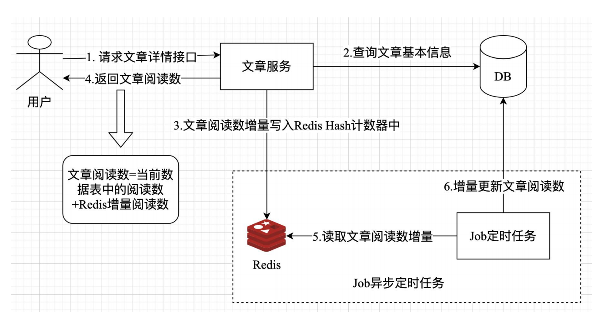

# 编写一个增量同步的阅读数服务
假设我们有一个文章服务，用户可以浏览文章标题、内容、阅读数等基本信息。
随着用户规模不断增长，例如：当用户量达到百万级别，甚至更高时，单纯使用 MySQL
数据库实现文章阅读数的读写，可能就无法应对大流量的冲击。此时，我们可能需要
考虑使用 Redis 和异步定时任务来解决高并发下文章阅读数更新。在这里，需要强调
一点：Redis 的作用是记录文章阅读数增量，定时任务的作用是将 Redis 记录的文章阅
读数增量定时同步到 MySQL 数据库实例相对应的数据表中。

当然，除了使用 Redis 之外，我们还可以使用其他解决方案实现文章阅读数增量
同步，例如：使用 Kafka 或 Pulsar 消息队列实现数据增量同步，从而更好地解决高并
发所带来的数据更新问题。由于篇幅限制，这里就不一一列举，具体技术实现可以参
考 8.4 章节的 Kafka 和 Pulsar 操作。



# 数据库
```sql
-- 创建文章系统数据库
create database article_sys charset = utf8mb4;

-- 选择数据库
use article_sys;

-- 创建articles表
CREATE TABLE `articles` (
   `id` bigint unsigned NOT NULL AUTO_INCREMENT COMMENT '自增id',
   `title` varchar(1000) CHARACTER SET utf8mb4 COLLATE utf8mb4_general_ci NOT NULL DEFAULT '' COMMENT '文章标题',
   `read_count` bigint unsigned NOT NULL DEFAULT '0' COMMENT '文章阅读数',
   `content` text CHARACTER SET utf8mb4 COLLATE utf8mb4_general_ci NOT NULL COMMENT '文章内容',
   `author` varchar(50) CHARACTER SET utf8mb4 COLLATE utf8mb4_general_ci NOT NULL DEFAULT '' COMMENT '文章创建者',
   `created_at` datetime NOT NULL COMMENT '文章创建时间',
   `updated_at` datetime DEFAULT NULL COMMENT '文章更新时间',
   `is_deleted` tinyint unsigned NOT NULL DEFAULT '0' COMMENT '是否删除，1已删除，0正常',
   PRIMARY KEY (`id`),
   KEY `idx_created_at` (`created_at`),
   KEY `idx_author_created_at` (`author`,`created_at`)
) ENGINE=InnoDB DEFAULT CHARSET=utf8mb4 COLLATE=utf8mb4_general_ci;

-- 插入数据
insert into articles (title,content,author,created_at) values
   ("rust程序设计基本介绍","这是一篇讲解rust基础知识的文章","daheige","2024-12-08 10:10:00"),
   ("rust项目实战","rust项目实战的文章","daheige","2024-12-08 10:10:08");

```

# 相关模块负责的事情
config：读取配置文件，从项目根目录下读取 app.yaml 配置，并完成配置初
始化操作。
entity：定义文章表模型，项目涉及到的表对应 rust 数据结构的映射。
handlers：用于 axum http 框架路由对应的处理器函数。
infras：项目中基础设置层定义，例如：mysql,redis 连接池管理的封装。
routers：axum http 框架运行时的路由模块。

# 服务启动
执行 cargo run 命令启动该 article-svc 服务

在浏览器中输入localhost:8080/api/article/1 访问文章
此时，服务端优先返回了文章的基本信息。对于文章增量阅读数则是通过 Redis hash 计数器的方式加
1 实现的。
在这里，文章阅读数 read_count 实际上等于当前数据表 articles 中的文章阅读数 + increment（增量
数）。

我们可以在 redis-cli 窗口中通过 hget article_sys:read_count:hash 1 命令查
看文章增量阅读数是否成功

# 定时任务消费
为了将文章阅读数增量同步到数据表 articles 中，需要一个定时任务处理 article-job
运行 cargo run --bin article-job 命令启动该 Job 定时任务时（如果你需要记
录操作记录，可以在终端中运行 RUST_LOG=debug cargo run --bin article-job 命令即
可）

当我们请求文章接口 http://localhost:8080/api/article/1 时，文章
增量阅读数就会实时更新到数据表 articles 中。当我们使用数据库桌面软件 Sequel Ace
查看 articles 表。

更多 MySQL 和 Redis 用法，你可以直接参考对应的官方文档，以获得更多的
帮助。
