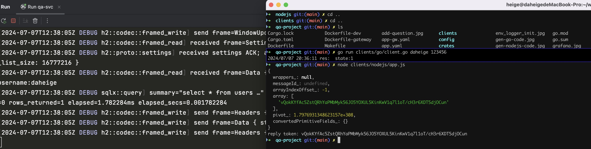
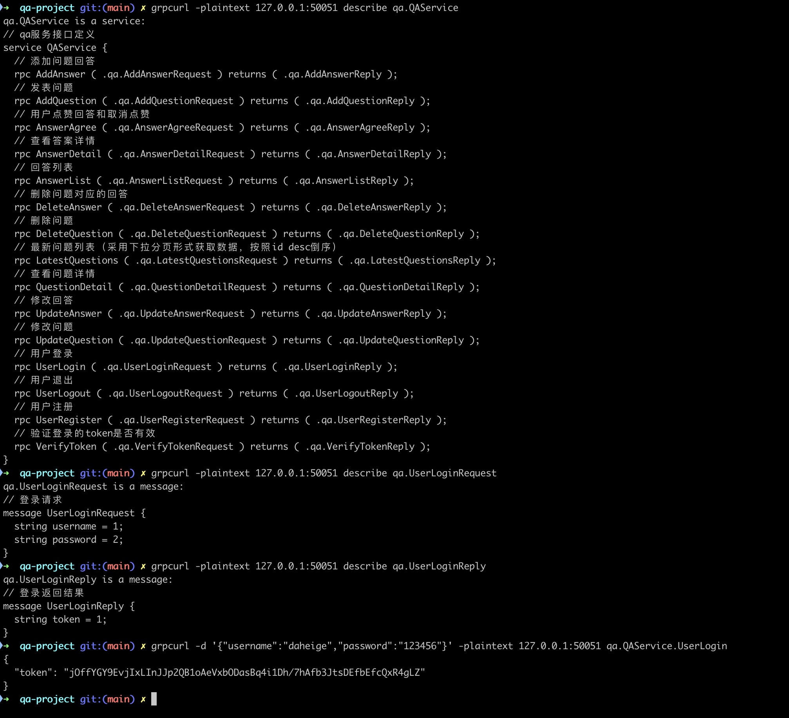

# qa-project
    综合型项目：QA问答系统
# grpc client support
- rust grpc微服务使用的crates: tokio,tonic,tonic-build,prost代码生成
- 支持rust/go/nodejs/php等不同客户端代码自动生成
- 支持http gateway模式（http json请求到网关层后，转换为pb message，然后发起grpc service调用）

# linux install protoc
1、下载protoc
```shell
cd /usr/local/src
sudo wget https://github.com/protocolbuffers/protobuf/archive/v3.15.8.tar.gz
```
2、安装protoc
```shell
# 解压文件
sudo mv v3.15.8.tar.gz protobuf-3.15.8.tar.gz
sudo tar zxvf protobuf-3.15.8.tar.gz
cd protobuf-3.15.8
# centos系统
sudo yum install gcc-c++ cmake libtool

# 对于ubuntu系统需要安装的依赖：
# sudo apt install gcc cmake make libtool

sudo mkdir /usr/local/protobuf
```

这里需要注意的一点: 在新版的 PB 源码中，是不包含 .configure 文件的，需要生成。此时先执行 sudo ./autogen.sh 脚本，说明如下:
```
# Run this script to generate the configure script and other files that will
# be included in the distribution. These files are not checked in because they
# are automatically generated.
```

此时生成了 .configure 文件，可以开始编译了
```shell
sudo ./configure --prefix=/usr/local/protobuf
sudo make && make install
```

安装完成后,查看版本:
```shell
cd /usr/local/protobuf/bin
./protoc --version
```
输出结果：libprotoc 3.15.8

建立软链接
```shell
sudo ln -s /usr/local/protobuf/bin/protoc /usr/bin/protoc
sudo chmod +x /usr/bin/protoc
```

# mac install protoc
```shell
brew install automake
brew install libtool
brew install protobuf
```
# start qa-svc
```shell
cp app.yaml crates/qa-svc
cargo run --bin qa-svc
```
运行效果如下：
```
Hello, qa-svc!
current process pid:96375
app run on:0.0.0.0:50051
```

# code gen for different clients
- gen go code
```shell
sh scripts/go-gen.sh
```
执行效果如下图所示：

运行客户端代码
```shell
go run clients/go/client.go daheige
```
输出如下：
```
2024/06/09 10:55:50 reply token:abc
```

- gen nodejs code
```shell
sh scripts/nodejs-gen.sh
```
install nodejs package
```shell
# 安装yarn，如果执行无权限，请使用`sudo npm install -g yarn`命令安装yarn
npm install -g yarn
cd clients/nodejs && yarn install
```
效果如下图所示：


run node client
```shell
node clients/nodejs/app.js
```
output:
```
{
    wrappers_: null,
    messageId_: undefined,
    arrayIndexOffset_: -1,
    array: [ 'abc' ],
    pivot_: 1.7976931348623157e+308,
    convertedPrimitiveFields_: {}
}
reply token:  abc
```
运行效果如下图所示：


- gen php code
```shell
sh scripts/php-gen.sh
```

# grpc grpcurl tools
grpcurl工具主要用于grpcurl请求，可以快速查看grpc proto定义以及调用grpc service定义的方法。
https://github.com/fullstorydev/grpcurl

tonic grpc reflection使用需要注意的事项：
- 使用这个操作必须将grpc proto的描述信息通过add_service添加才可以
- tonic 和 tonic-reflection 以及 tonic-build 需要相同的版本，这个需要在Cargo.toml设置一样

1. 安装grpcurl工具
```shell
brew install grpcurl
```
如果你本地安装了golang，那可以直接运行如下命令，安装grpcurl工具
 ```shell
 go install github.com/fullstorydev/grpcurl/cmd/grpcurl@latest
 ```

2. 验证rs-rpc service启动的效果
```shell
# 50051 是qa-svc grpc微服务的端口
grpcurl -plaintext 127.0.0.1:50051 list
```
执行上面的命令，输出结果如下：
```
grpc.reflection.v1alpha.ServerReflection
qa.QAService
```
3. 查看proto文件定义的所有方法
```shell
grpcurl -plaintext 127.0.0.1:50051 describe qa.QAService
```
输出结果如下：
```protobuf
// qa.QAService is a service:
// qa服务接口定义
service QAService {
  // 添加问题回答
  rpc AddAnswer ( .qa.AddAnswerRequest ) returns ( .qa.AddAnswerReply );
  // 发表问题
  rpc AddQuestion ( .qa.AddQuestionRequest ) returns ( .qa.AddQuestionReply );
  // 用户点赞回答
  rpc AnswerAgree ( .qa.AnswerAgreeRequest ) returns ( .qa.AnswerAgreeReply );
  // 回答列表
  rpc AnswerList ( .qa.AnswerListRequest ) returns ( .qa.AnswerListReply );
  // 删除问题对应的回答
  rpc DeleteAnswer ( .qa.DeleteAnswerRequest ) returns ( .qa.DeleteAnswerReply );
  // 删除问题
  rpc DeleteQuestion ( .qa.DeleteQuestionRequest ) returns ( .qa.DeleteQuestionReply );
  // 最新问题列表（采用下拉分页形式获取数据，按照id desc倒序）
  rpc LatestQuestions ( .qa.LatestQuestionsRequest ) returns ( .qa.LatestQuestionsReply );
  // 查看问题详情
  rpc QuestionDetail ( .qa.QuestionDetailRequest ) returns ( .qa.QuestionDetailReply );
  // 问题阅读数
  rpc QuestionReadCount ( .qa.QuestionReadCountRequest ) returns ( .qa.QuestionReadCountReply );
  // 修改回答
  rpc UpdateAnswer ( .qa.UpdateAnswerRequest ) returns ( .qa.UpdateAnswerReply );
  // 修改问题
  rpc UpdateQuestion ( .qa.UpdateQuestionRequest ) returns ( .qa.UpdateQuestionReply );
  // 用户登录
  rpc UserLogin ( .qa.UserLoginRequest ) returns ( .qa.UserLoginReply );
  // 用户退出
  rpc UserLogout ( .qa.UserLogoutRequest ) returns ( .qa.UserLogoutReply );
  // 用户注册
  rpc UserRegister ( .qa.UserRegisterRequest ) returns ( .qa.UserRegisterReply );
}
 ```
4. 查看请求qa.UserLoginRequest请求参数定义
 ```shell
 grpcurl -plaintext 127.0.0.1:50051 describe qa.UserLoginRequest
 ```
完整的HelloReq定义如下：
```
qa.UserLoginRequest is a message:
// 登录请求
message UserLoginRequest {
    string username = 1;
    string password = 2;
}
```
5. 查看相应qa.UserLoginReply响应结果定义
```shell
grpcurl -plaintext 127.0.0.1:8081 describe qa.UserLoginReply
```
完整的HelloReply定义如下：
```
qa.UserLoginReply is a message:
// 登录返回结果
message UserLoginReply {
  string token = 1;
}
```
6. 通过grpcurl调用rpc service method
 ```shell
 grpcurl -d '{"username":"daheige","password":"abc"}' -plaintext 127.0.0.1:50051 qa.QAService.UserLogin
 ```
响应结果如下：
 ```json
{
  "token": "xxx"
}
 ```
运行效果如下图所示：


# run grpc http gateway
please crates/gateway/main.rs
```shell
cp app-gw.yaml crates/gateway
cargo run --bin gateway
```
output:
```
Finished `dev` profile [unoptimized + debuginfo] target(s) in 1.31s
 Running `target/debug/gateway`
conf:AppConfig { app_debug: true, app_port: 8090, grpc_address: "http://127.0.0.1:50051", graceful_wait_time: 3 }
current process pid:96460
app run on:0.0.0.0:8090
```

curl http gateway
```shell
curl --location 'localhost:8090/api/user/login' \
--header 'Content-Type: application/json' \
--data '{
    "username":"daheige",
    "password":"abc"
}'
```
output:
```
{
    "code": 0,
    "message": "ok",
    "data": {
        "token": "abc"
    }
}
```
http gateway运行机制(图片来自grpc-ecosystem/grpc-gateway):


# go grpc gmicro
https://github.com/daheige/gmicro

# go grpc demo
https://github.com/daheige/gmicro-demo

# go grpc http gateway
https://github.com/grpc-ecosystem/grpc-gateway
