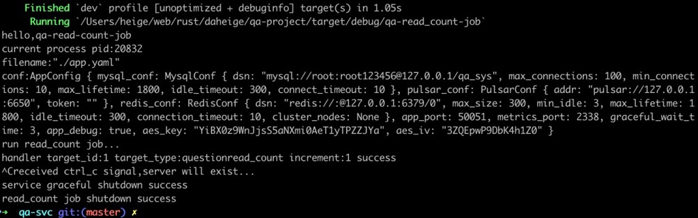

# 问题阅读数技术实现和定时job剖析

```rust
// 在11.3.3章节中提到的ReadCountRepo trait实现的核心代码如下所示：
// qa-svc/src/infrastructure/read_count/entity_read_count.rs文件
use crate::domain::entity::{EntityReadCountData, QuestionsEntity};
use crate::domain::repository::ReadCountRepo;
use log::info;
use r2d2::Pool;
use redis::Commands;

// ReadCountRepoImpl实现ReadCountRepo trait的具体数据类型
struct ReadCountRepoImpl {
    redis_pool: Pool<redis::Client>,
    mysql_pool: sqlx::MySqlPool,
}

// 创建一个ReadCountRepo实例对象
pub fn new_read_count_repo(
    redis_pool: Pool<redis::Client>,
    mysql_pool: sqlx::MySqlPool,
) -> impl ReadCountRepo {
    ReadCountRepoImpl {
        redis_pool,
        mysql_pool,
    }
}

impl ReadCountRepoImpl {
    fn get_entity_table(&self, target_type: &str) -> String {
        if target_type == "question" {
            return QuestionsEntity::table_name();
        }

        return "unknown".to_string();
    }

    fn get_hash_key(&self, target_type: &str) -> String {
        format!("qa_sys:{}:read_count:hash", target_type)
    }

    // 将redis hash中实体增量计数器对应的数量，更新到对应的实体数据表中，并对应减少对应的数量
    async fn update_read_count(&self, target_id: i64, target_type: &str, increment: i64) {
        info!(
            "update target_id:{} target_type:{} read_count increment:{} begin",
            target_id, target_type, increment
        );
        let sql = format!(
            "update {} set read_count = read_count + ? where id = ?",
            self.get_entity_table(target_type),
        );

        let res = sqlx::query(&sql)
            .bind(increment)
            .bind(target_id)
            .execute(&self.mysql_pool)
            .await;
        info!(
            "execute target_id:{} target_type:{} result:{:?}",
            target_id, target_type, res
        );
        if res.is_ok() {
            // 更新redis hash 实体阅读数对应的计数器
            // redis hash 的field是实体id，value是阅读数
            let hash_key = self.get_hash_key(target_type);
            let mut conn = self.redis_pool.get().expect("get redis connection failed");
            let remain: i64 = conn
                .hincr(hash_key, target_id.to_string(), -increment)
                .expect("redis hincr failed");
            info!(
                "current target_id:{} target_type:{} hincry result:{}",
                target_id, target_type, remain
            );
        }

        info!(
            "update target_id:{} target_type:{} read_count increment:{} end",
            target_id, target_type, increment
        );
    }
}

#[async_trait::async_trait]
impl ReadCountRepo for ReadCountRepoImpl {
    async fn incr(&self, data: &EntityReadCountData) -> anyhow::Result<u64> {
        // redis hash 的field是target_id对应的字符串格式，value是阅读数增量计数器
        // 对问题阅读数增量计数器加1操作，后续可以通过job定期处理，将阅读数同步到db即可
        let hash_key = self.get_hash_key(&data.target_type);
        let mut conn = self.redis_pool.get().expect("get redis connection failed");
        let field = data.target_id.to_string();
        let increment: i64 = conn.hincr(&hash_key, field, data.count as i64)?;

        info!(
            "current target_id:{} target_type:{} hincr result:{}",
            data.target_id, data.target_type, increment
        );

        Ok(increment as u64)
    }

    async fn handler(&self, target_type: &str) -> anyhow::Result<()> {
        // 读取redis hash记录
        let hash_key = self.get_hash_key(target_type);
        let mut conn = self.redis_pool.get().expect("get redis connection failed");

        // 返回对应的key val key val...格式，对应的是id read_count增量计数器的字符串格式
        let res: redis::Iter<String> = conn.hscan_match(hash_key, "*").unwrap();
        let records: Vec<String> = res.collect();
        let len = records.len();
        if len == 0 {
            return Ok(());
        }

        // 执行实体阅读数增量更新操作
        let mut i: usize = 0;
        while i < len {
            // 当前实体id
            let target_id: i64 = records.get(i).unwrap().parse().unwrap();
            // 当前实体增量计数器
            let increment: i64 = records.get(i + 1).unwrap().parse().unwrap();
            i += 2; // 这里i的值第一次迭代时 i = 0，第二次迭代 i = 2,依次类推
            if increment == 0 || target_id <= 0 {
                continue;
            }

            info!(
                "target_id:{} target_type:{}read_count increment:{}",
                target_id, target_type, increment
            );
            self.update_read_count(target_id, target_type, increment)
                .await;
            println!(
                "handler target_id:{} target_type:{}read_count increment:{} success",
                target_id, target_type, increment
            );
        }

        Ok(())
    }
}
```

- 在上述代码中，首先在incr方法中声明了一个hash_key变量，它根据target_type类型生成对应的redis hash key。
- 然后，调用self.redis_pool.get方法从redis连接池中获取了一个redis
  connection句柄，并调用hincr方法对field（实体target_id对应的字符串格式）增加data.count，返回值是一个i64类型，它表示当前实体阅读数计数器增量数。
- 在handler方法中，首先调用conn.hscan_match方法通过*匹配方式以及redis游标形式获取hash_key中的每个元素（field:value格式）。
- 接着，通过判断当前hash_key中的元素个数是否大于0，如果大于0就调用self.update_read_count方法执行实体阅读数的增量更新。
- 在update_read_count方法中，首先通过sqlx::query绑定sql的方式更新当前实体的read_count字段，然后判断更新结果res是否操作成功。
- 如果操作成功，就调用conn上的hincr方法减去redis hash_key对应的field（实体id)对应的阅读数，通过这种方式实现了实体阅读数增量更新到数据库表questions中。

接下来，让我们先使用grpcurl工具查看qa.QAService.AddQuestion方法以及该方法的请求参数，然后请求qa-svc微服务创建一个问题，执行命令如下：

```shell
grpcurl -plaintext 127.0.0.1:50051 describe qa.QAService.AddQuestion
grpcurl -plaintext 127.0.0.1:50051 describe .qa.AddQuestionRequest
grpcurl -d '{"title":"rust实战","created_by":"daheige","content":"qa微服务"}' -plaintext 127.0.0.1:50051 qa.QAService.AddQuestion
```

运行效果如下图所示：


从11.3.3章节的图11-5中可知，当查看问题时，阅读数是通过Redis hash计数器形式实现的，需要在查看问题详情qa.QuestionDetail方法中调用ReadCountRepo
incr方法，同时通过异步job的形式增量更新阅读数到数据表中。
问题详情对应的qa.QuestionDetail方法核心代码如下所示：

```rust
// qa-project/crates/qa-svc/src/application/qa.rs 文件
#[async_trait::async_trait]
impl QaService for QAServiceImpl {
    // 省略其他代码...
    // 查看问题详情
    async fn question_detail(
        &self,
        request: Request<QuestionDetailRequest>,
    ) -> Result<Response<QuestionDetailReply>, Status> {
        let req = request.into_inner();
        info!("request question id:{} username:{}", req.id, req.username);
        // question_repo是一个Box<dyn QuestionRepo>类型，
        // 它是一个trait object类型的智能指针
        let res = self.question_repo.fetch_one(req.id).await;
        if let Err(err) = res {
            let err = err.downcast().unwrap();
            match err {
                sqlx::Error::RowNotFound => {
                    return Err(Status::new(
                        Code::NotFound,
                        "current question not found".to_string(),
                    ));
                }
                _ => {
                    info!("failed to query question id:{},error:{}", req.id, err);
                }
            }

            return Err(Status::new(
                Code::Unknown,
                "failed to query question".to_string(),
            ));
        }

        let entry = res.unwrap();
        // 增加问题阅读数
        let data = EntityReadCountData {
            target_id: entry.id,
            target_type: "question".to_string(),
            count: 1,
        };
        let mut read_count = entry.read_count as i64;
        let read_count_res = self.read_count_repo.incr(&data).await;
        if let Err(err) = read_count_res {
            info!(
            "failed to incr question id:{} read_count,error:{}",
            entry.id, err
         );
        } else {
            // 当前阅读数=问题原有阅读数+计数器增量数
            read_count += read_count_res.unwrap() as i64;
        }

        let read_count = read_count as u64; // 当前问题阅读数
        println!("question_id:{} read_count:{}", req.id, read_count);

        // 返回问题基本信息
        let question = QuestionEntity {
            id: entry.id,
            title: entry.title,
            content: entry.content,
            created_by: entry.created_by,
            read_count,
            reply_count: entry.reply_count,
        };
        let reply = QuestionDetailReply {
            question: Some(question),
        };
        Ok(Response::new(reply))
    }
    // 省略其他代码...
}
```

- 从上述代码可以看出，首先通过self.question_repo上面的fetch_one方法获取问题基本信息。
- 然后通过if let Err(err)模式匹配判断查询过程中是否存在错误。如果存在错误就通过err.downcast().unwrap()
  方法解析出原始的sqlx::Error。
- 接着，使用match模式匹配进一步判断是否是sqlx::Error::
  RowNotFound错误。如果问题不存在，就返回对应的错误信息，否则就记录错误日志，并返回错误信息。它是使用Status::
  new静态方法接收Code::Unknown和具体错误信息为参数的Error类型实现的。
- 如果问题存在时，就使用self.read_count_repo（ReadCountRepo
  trait对应的实例对象）上面的incr方法增加问题阅读数（这个数字是一个增量计数器），因此该问题的阅读数=问题原有阅读数+计数器增量数。
- 最后，在question_detail方法通过Ok(Response::new(reply))放回了问题基本信息。

为了验证用户查看某个问题详情时，问题阅读数也会随之增量更新。我在qa-svc/src下面新建了read_count_job.rs文件，并添加如下代码：

```rust
// qa-svc/src/read_count_job.rs文件
// ...省略其他代码...
// 定义模块
mod config;
mod domain;
mod infrastructure;

// 日志level 优先级 error > warn > info > debug > trace
// 启动方式：RUST_LOG=debug cargo run --bin qa-read_count-job
#[tokio::main]
async fn main() -> anyhow::Result<()> {
    println!("hello,qa-read-count-job");
    // std::env::set_var("RUST_LOG", "debug");
    Logger::new().init(); // 使用默认方式初始化日志配置
    println!("current process pid:{}", process::id());

    // create mysql pool
    let mysql_pool = mysql::pool(&APP_CONFIG.mysql_conf)
        .await
        .expect("mysql pool init failed");

    // create redis pool
    let redis_pool = xredis::pool(&APP_CONFIG.redis_conf)
        .expect("redis pool init failed");
    let app_state = config::ReadCountJobAppState {
        // 这里等价于mysql_pool: mysql_pool
        // 当变量名字一样时，是可以直接用变量名字简写模式，是rust的语法糖
        mysql_pool,
        // 这里等价于pulsar_client: pulsar_client
        redis_pool,
    };

    // 平滑退出stop标识，用于消费者退出标识，
    // 它是一个引用计数bool类型的异步读写锁。
    let stop = Arc::new(RwLock::new(false));
    let stop1 = stop.clone();
    let read_count_repo = new_read_count_repo(app_state.redis_pool, app_state.mysql_pool);
    println!("run read_count job...");
    // 处理问题阅读数
    tokio::spawn(async move {
        // 每隔2s执行一次
        let mut interval = tokio::time::interval(Duration::from_secs(2));
        loop {
            let exit = stop1.read().await;
            if *exit {
                info!("recv shutdown signal,consumer will stop...");
                break;
            }

            interval.tick().await;
            // println!("handler question read_count");
            let res = read_count_repo.handler("question").await;
            if let Err(err) = res {
                info!("handler read_count error:{}", err);
            }
        }
    });

    // 等待退出信号量的到来
    let handler = tokio::spawn(async move {
        graceful_shutdown(Duration::from_secs(APP_CONFIG.graceful_wait_time)).await;
    });

    // 这里会阻塞，只有接收到退出信号量，才会执行退出操作
    handler.await.unwrap();
    // 当接收到退出信号量时，将stop的值设置为true
    let mut exit = stop.write().await;
    *exit = true;
    println!("read_count job shutdown success");
    Ok(())
}
```

- 在上述read_count.rs代码中，首先定义了config、domain、infrastructure等子模块。
- 然后，在main函数中，使用mysql::pool和xredis::pool函数，分别创建了MySQL和Redis连接池。
- 随后，通过new_read_count_repo方法创建了read_count_repo对象。
- 接着，使用tokio::spawn创建了一个async块。在这个async块中，首先通过tokio::time::
  interval方法创建一个每隔2s的定时器，然后通过loop关键字创建了一个循环代码块。
- 在该循环代码中，首先通过stop1.read()方法读取Arc::new(RwLock::new(false))
  创建的stop引用计数变量，如果它的值是true就表示应用程序已接收到平滑退出信号量，此时循环就会退出，否则就执行interval.tick()
  方法。
- 该tick方法是tokio提供的一个定时触发器。随后，我们调用read_count_repo对象上的handler方法处理问题阅读数增量更新。
- 在main函数的末尾，通过tokio::spawn创建了一个异步任务，在async代码块中运行graceful_shutdown函数，它的作用是等待退出信号量到来。
- 在这里我将tokio::spawn的执行结果赋值给handler变量，其类型是tokio::JoinHandle，在handler上面使用await关键字，以阻塞的形式等待退出信号量的到来。

graceful_shutdown函数代码如下所示：

```rust
// qa-project/crates/infras/src/shutdown.rs 文件
use std::time::Duration;
use tokio::signal; // 引入tokio signal模块

// 平滑退出处理，它是通过接收退出信号量的方式完成，
// 当接收到退出信号量时，程序会等待一段时间，再退出。
// 在这个退出期间，程序可以做一些其他的清理操作
pub async fn graceful_shutdown(wait_time: Duration) {
    let ctrl_c = async {
        signal::ctrl_c()
            .await
            .expect("failed to install ctrl+c handler");
    };

    #[cfg(unix)]
        let terminate = async {
        signal::unix::signal(signal::unix::SignalKind::terminate())
            .expect("failed to install signal handler")
            .recv()
            .await;
    };

    #[cfg(not(unix))]
        let terminate = std::future::pending::<()>();

    // 监听退出信号量
    tokio::select! {
      _ = ctrl_c =>{
         println!("received ctrl_c signal,server will exist...");
      },
      _ = terminate => {
         println!("received terminate signal,server will exist...");
      },
   }

    // 平滑退出等待时长
    tokio::time::sleep(wait_time).await;
    println!("service graceful shutdown success");
}
```

- 从上述graceful_shutdown函数代码可以查看，如果程序接收到退出信号量，就会将stop的值设置为true。一旦stop的值设置为true，read_count_job.rs文件中的loop循环退出逻辑。
- 到这里为止，这个read_count_job.rs对应的job定时任务还不能正常运行，我们需要在qa-svc/Cargo.toml文件中添加如下内容，将其标记为一个bin（二进制应用程序）。

```toml
# 阅读数job
[[bin]]
name = "qa-read_count-job"
path = "src/read_count_job.rs"
```

接下来，我们先执行cargo run --bin qa-read_count-job命令启动job（在启动job之前，请确保qa-svc服务已经启动，如果没有启动可以通过cargo
run --bin qa-svc命令启动qa-svc服务），然后再执行如下命令请求问题详情接口。

```shell
grpcurl -d '{"id":1,"username":"daheige"}' -plaintext 127.0.0.1:50051 qa.QAService.QuestionDetail
```

运行效果，如下图所示：


从上图中看出，当我们通过grpcurl请求问题详情时，就会返回当前问题的阅读数。同时，qa-read_count-job脚本会将阅读数增量同步到数据库表questions表中，效果如下图所示：


为了验证qa-read_count-job平滑退出功能点，我们可以同时按住Ctrl+C两个键，然后观察程序退出效果，如下图所示：


