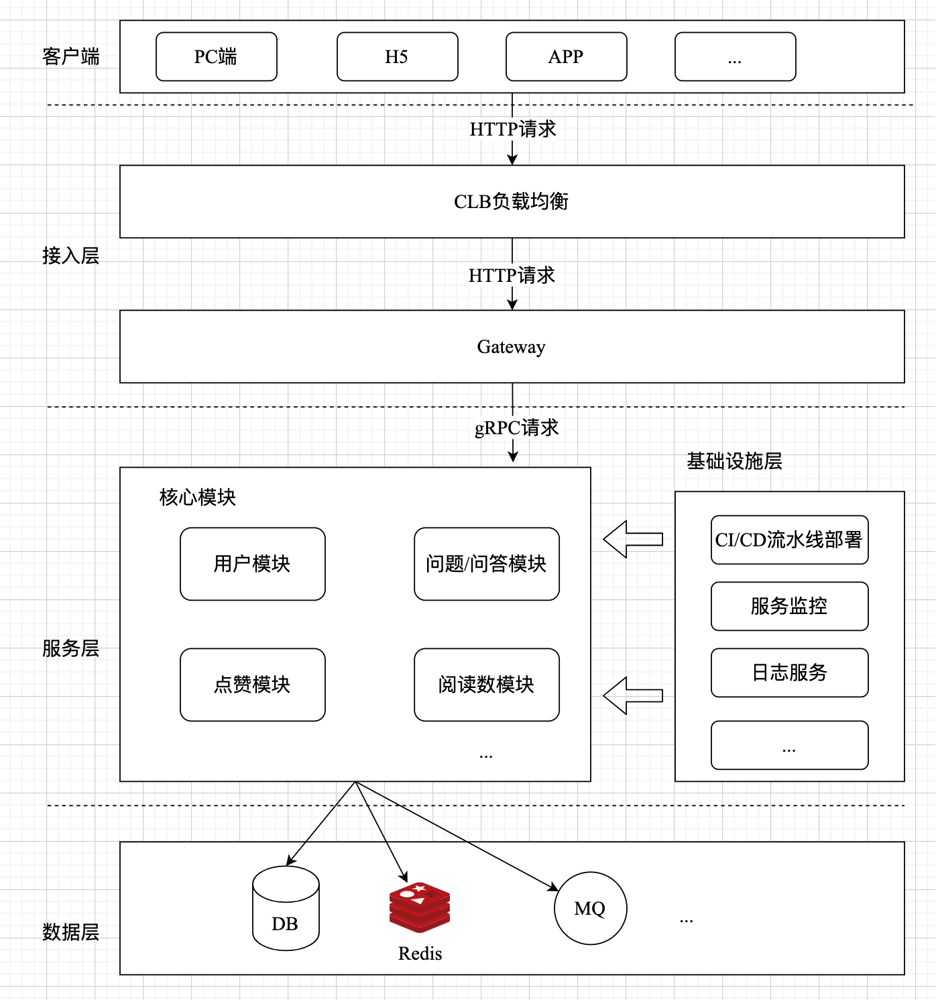
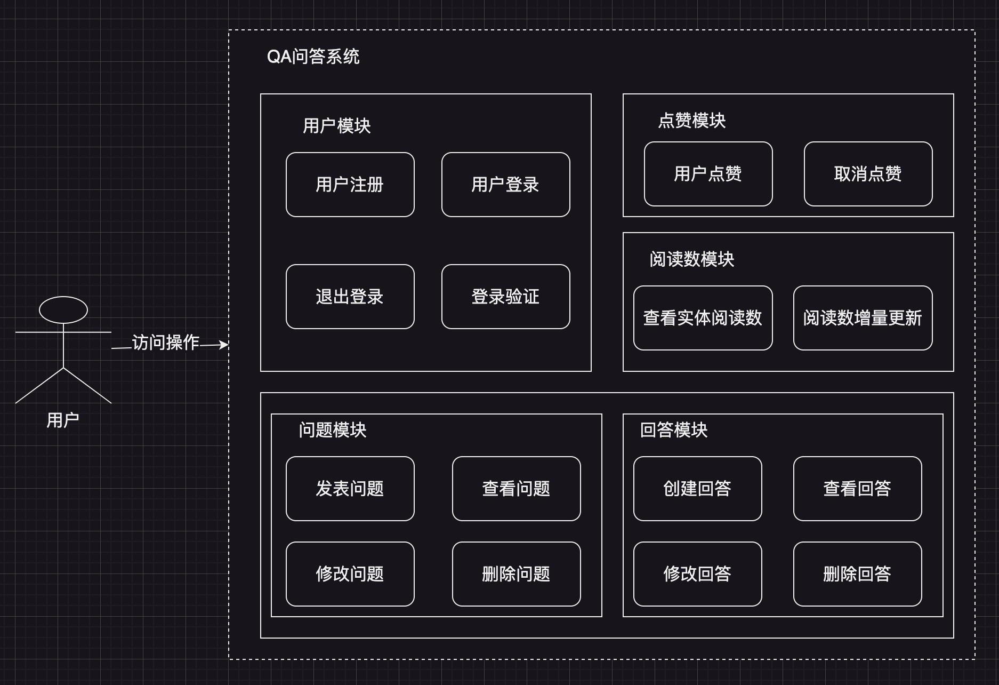
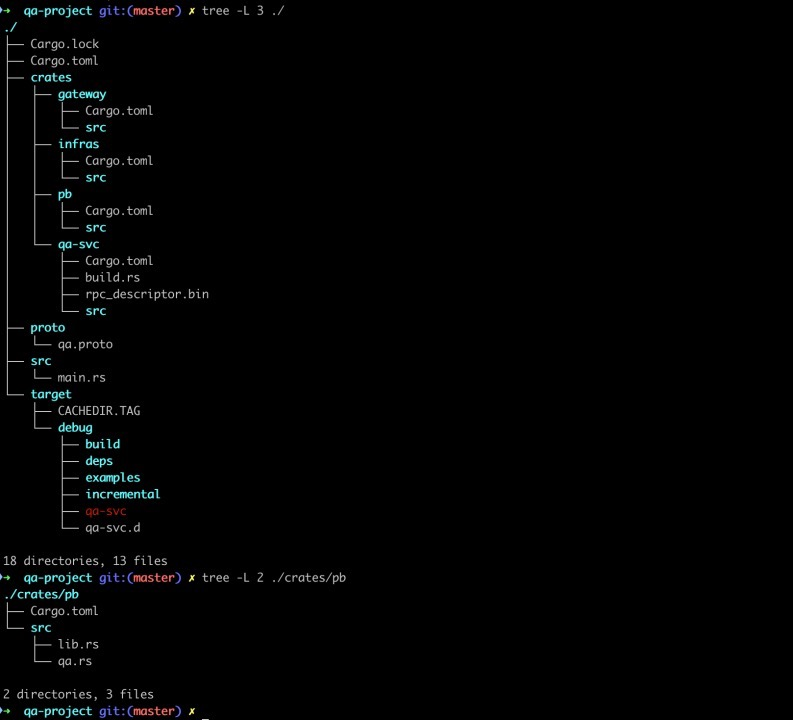
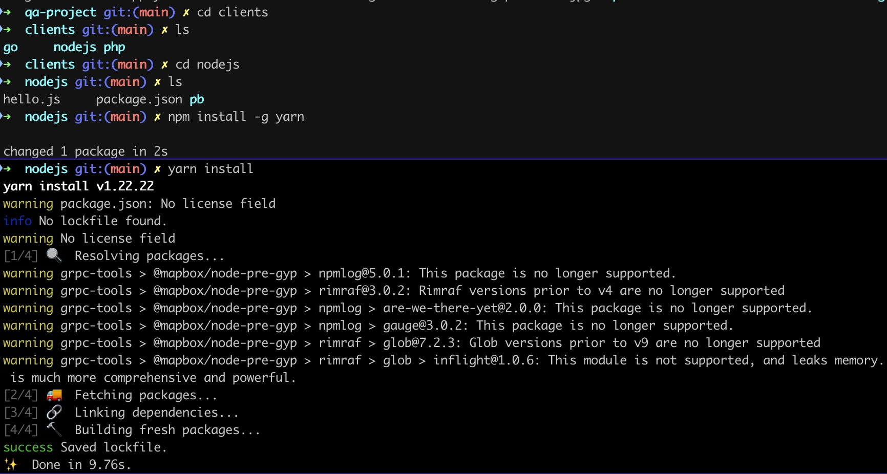
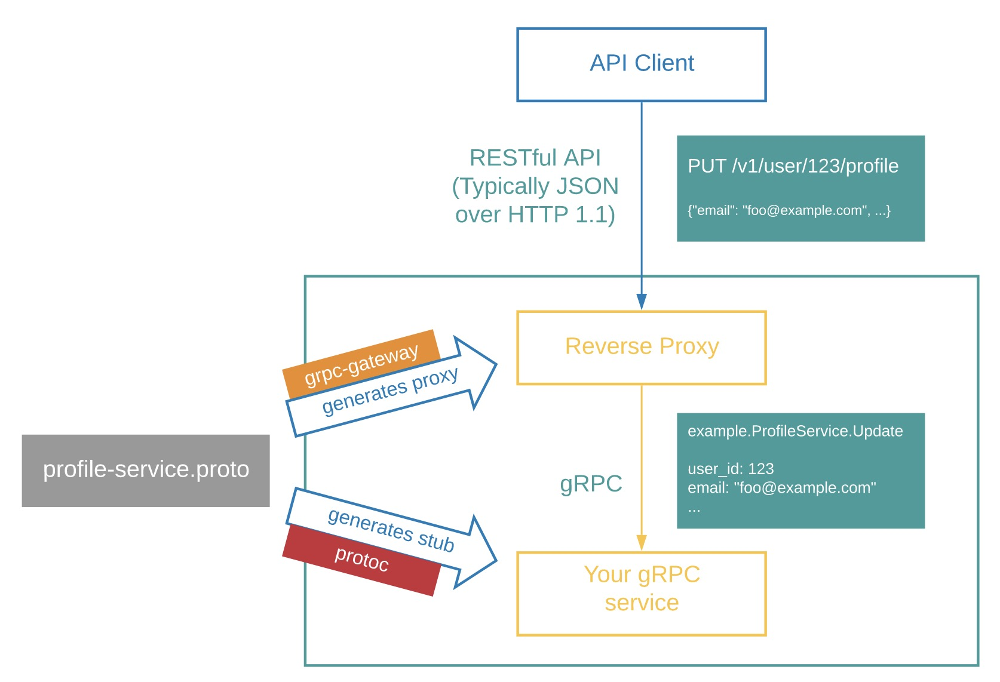
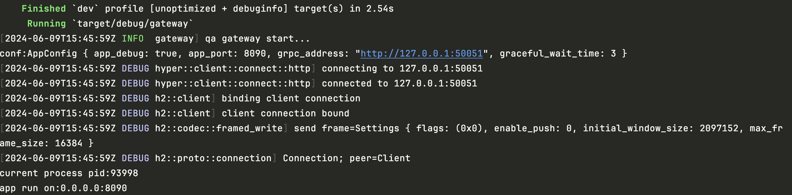
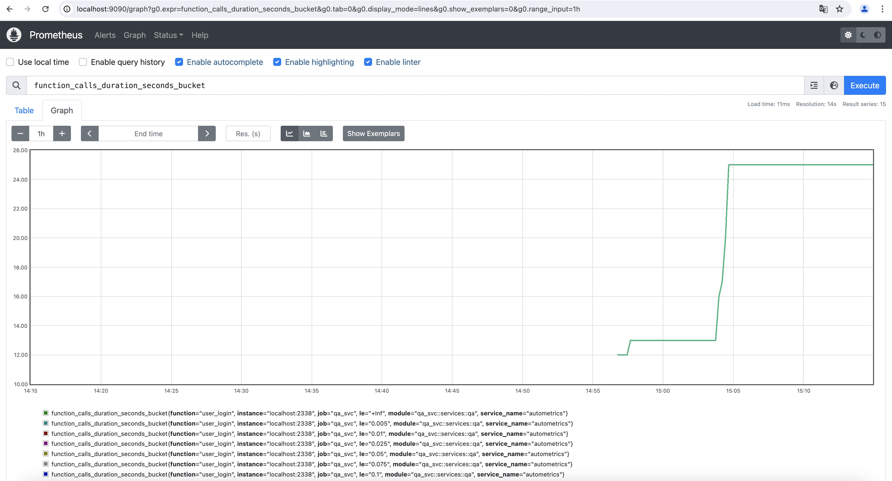
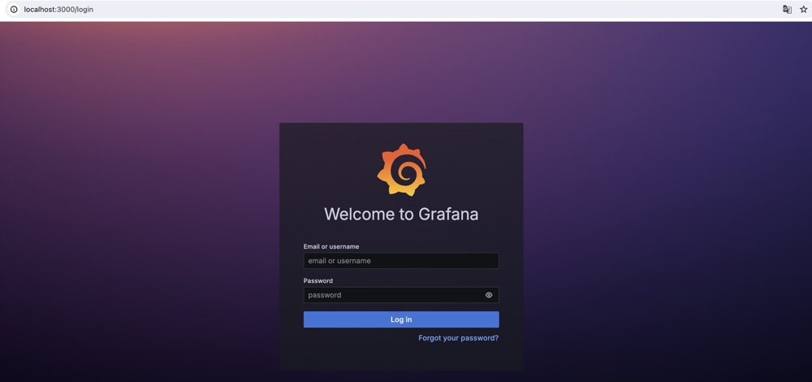

# qa-project

    综合型项目：QA问答系统

# 整体架构



# 核心模块



# layout分层

整个项目采用rust workspace工作空间模式的方式组织代码，放在crates目录中。

- qa-svc用于实现QA系统grpc微服务以及阅读数job和点赞数job，分别对应三个二进制应用程序。
- infras负责整个项目的基础设施层，它是一个library库，其中包含MySQL、Redis、Pulsar以及config、logger、metrics、shutdown等模块的封装。
- pb存放protoc工具自动生成的rust代码，它是一个library库，通过tonic-build工具读取proto/qa.proto文件并生成rust代码。
- gateway是grpc http gateway，它是一个二进制应用程序，接收外部http请求并将json数据格式转换为pb
  Message请求下游qa-svc中对应的grpc服务。

layout分层，如下图所示：


# grpc client support

- rust grpc微服务使用的crates: tokio,tonic,tonic-build,prost代码生成
- 支持rust/go/nodejs/php等不同客户端代码自动生成
- 支持http gateway模式（http json请求到网关层后，转换为pb message，然后发起grpc service调用）

# linux install protoc

1、下载protoc

```shell
cd /usr/local/src
sudo wget https://github.com/protocolbuffers/protobuf/archive/v3.15.8.tar.gz
```

2、安装protoc

```shell
# 解压文件
sudo mv v3.15.8.tar.gz protobuf-3.15.8.tar.gz
sudo tar zxvf protobuf-3.15.8.tar.gz
cd protobuf-3.15.8
# centos系统
sudo yum install gcc-c++ cmake libtool

# 对于ubuntu系统需要安装的依赖：
# sudo apt install gcc cmake make libtool

sudo mkdir /usr/local/protobuf
```

这里需要注意的一点: 在新版的 PB 源码中，是不包含 .configure 文件的，需要生成。此时先执行 sudo ./autogen.sh 脚本，说明如下:

```
# Run this script to generate the configure script and other files that will
# be included in the distribution. These files are not checked in because they
# are automatically generated.
```

此时生成了 .configure 文件，接下来就可以开始编译了

```shell
sudo ./configure --prefix=/usr/local/protobuf
sudo make && make install
```

安装完成后,查看版本:

```shell
cd /usr/local/protobuf/bin
./protoc --version
```

输出结果：libprotoc 3.15.8

建立软链接

```shell
sudo ln -s /usr/local/protobuf/bin/protoc /usr/bin/protoc
sudo chmod +x /usr/bin/protoc
```

# ubuntu install protoc

```shell
# 安装相关依赖
sudo apt-get install gcc cmake make libtool
# 安装protobuf工具包
sudo apt-get install libprotobuf-dev protocbuf-compiler
# 查看安装版本
protoc --version
```

# mac install protoc

```shell
brew install automake
brew install libtool
brew install protobuf
```

# Preparations before starting qa-svc

启动qa-svc之前，需要做的事情：

- 安装好对应的protoc工具链（参考Makefile或者scripts中的shell脚本）
- 启动pulsar docker容器服务或使用pulsar云服务

```shell
sh scripts/pulsar-run.sh
```

- 安装好mysql服务或使用mysql云服务，创建qa_sys数据库，并将`qa.sql`中的SQL语句导入到数据库中即可
- 安装好redis服务或使用redis云服务

# start qa-svc

```shell
cp app.yaml crates/qa-svc
cargo run --bin qa-svc
```

运行效果如下：

```
Hello, qa-svc!
current process pid:96375
app run on:0.0.0.0:50051
```

# code gen for different clients

- gen go code

```shell
sh scripts/go-gen.sh
```

执行效果如下图所示：

运行客户端代码，注册用户`daheige`

```shell
go run clients/go/client.go daheige 123456
```

输出如下：

```
2024/07/07 20:36:11 res:  state:1
```

- gen nodejs code

```shell
sh scripts/nodejs-gen.sh
```

install nodejs package

```shell
# 安装yarn，如果执行无权限，请使用`sudo npm install -g yarn`命令安装yarn
npm install -g yarn
cd clients/nodejs && yarn install
```

效果如下图所示：


run node client

```shell
# 用户登录
node clients/nodejs/app.js
```

output:

```
{
  wrappers_: null,
  messageId_: undefined,
  arrayIndexOffset_: -1,
  array: [
    'vQokKYfAc5ZstQRhYaPMbMyk56JO5YOXUL5KinKwV1q7l1oT/cH3r6XDT5djOCun'
  ],
  pivot_: 1.7976931348623157e+308,
  convertedPrimitiveFields_: {}
}
reply token: vQokKYfAc5ZstQRhYaPMbMyk56JO5YOXUL5KinKwV1q7l1oT/cH3r6XDT5djOCun
```

运行效果如下图所示：


- gen php code

```shell
sh scripts/php-gen.sh
```

run php client

```shell
composer install
# 用户登录
php clients/php/qa.php daheige 123456
```

运行效果如下所示：

```
status code: 0
reply token: A1LqnrNsnyINFCxY6kSoHYnQCzX4IUbaCJpUn03HBJc03ZK9wMusAW7lQwE+zJX7
```

# grpc grpcurl tools

- grpcurl工具主要用于grpcurl请求，可以快速查看grpc proto定义以及调用grpc service定义的方法。
- grpcurl参考地址：https://github.com/fullstorydev/grpcurl
- tonic grpc reflection使用需要注意的事项：
    - 使用这个操作必须将grpc proto的描述信息通过add_service添加才可以
    - tonic 和 tonic-reflection 以及 tonic-build 需要相同的版本，这个需要在Cargo.toml设置一样

1. 安装grpcurl工具

```shell
brew install grpcurl
```

如果你本地安装了golang，那可以直接运行如下命令，安装grpcurl工具

```shell
go install github.com/fullstorydev/grpcurl/cmd/grpcurl@latest
```

2. 验证rs-rpc service启动的效果

```shell
# 50051 是qa-svc grpc微服务的端口
grpcurl -plaintext 127.0.0.1:50051 list
```

执行上面的命令，输出结果如下：

```
grpc.reflection.v1alpha.ServerReflection
qa.QAService
```

3. 查看proto文件定义的所有方法

```shell
grpcurl -plaintext 127.0.0.1:50051 describe qa.QAService
```

输出结果如下：

```protobuf
// qa.QAService is a service:
// qa服务接口定义
service QAService {
  // 添加问题回答
  rpc AddAnswer (.qa.AddAnswerRequest) returns (.qa.AddAnswerReply);
  // 发表问题
  rpc AddQuestion (.qa.AddQuestionRequest) returns (.qa.AddQuestionReply);
  // 用户点赞回答和取消点赞
  rpc AnswerAgree (.qa.AnswerAgreeRequest) returns (.qa.AnswerAgreeReply);
  // 查看答案详情
  rpc AnswerDetail (.qa.AnswerDetailRequest) returns (.qa.AnswerDetailReply);
  // 回答列表
  rpc AnswerList (.qa.AnswerListRequest) returns (.qa.AnswerListReply);
  // 删除问题对应的回答
  rpc DeleteAnswer (.qa.DeleteAnswerRequest) returns (.qa.DeleteAnswerReply);
  // 删除问题
  rpc DeleteQuestion (.qa.DeleteQuestionRequest) returns (.qa.DeleteQuestionReply);
  // 最新问题列表（采用下拉分页形式获取数据，按照id desc倒序）
  rpc LatestQuestions (.qa.LatestQuestionsRequest) returns (.qa.LatestQuestionsReply);
  // 查看问题详情
  rpc QuestionDetail (.qa.QuestionDetailRequest) returns (.qa.QuestionDetailReply);
  // 修改回答
  rpc UpdateAnswer (.qa.UpdateAnswerRequest) returns (.qa.UpdateAnswerReply);
  // 修改问题
  rpc UpdateQuestion (.qa.UpdateQuestionRequest) returns (.qa.UpdateQuestionReply);
  // 用户登录
  rpc UserLogin (.qa.UserLoginRequest) returns (.qa.UserLoginReply);
  // 用户退出
  rpc UserLogout (.qa.UserLogoutRequest) returns (.qa.UserLogoutReply);
  // 用户注册
  rpc UserRegister (.qa.UserRegisterRequest) returns (.qa.UserRegisterReply);
  // 验证登录的token是否有效
  rpc VerifyToken (.qa.VerifyTokenRequest) returns (.qa.VerifyTokenReply);
}
```

4. 查看qa.UserLoginRequest定义
```shell
grpcurl -plaintext 127.0.0.1:50051 describe qa.UserLoginRequest
```
输出结果如下：
```
qa.UserLoginRequest is a message:
// 登录请求
message UserLoginRequest {
    string username = 1;
    string password = 2;
}
```

5. 查看相应qa.UserLoginReply响应结果定义

```shell
grpcurl -plaintext 127.0.0.1:50051 describe qa.UserLoginReply
```

完整的HelloReply定义如下：
```
qa.UserLoginReply is a message:
// 登录返回结果
message UserLoginReply {
  string token = 1;
}
```

6. 通过grpcurl调用rpc service method
先通过如下grpcurl命令创建一个用户：
```shell
grpcurl -d '{"username":"daheige","password":"123456"}' -plaintext 127.0.0.1:50051 qa.QAService.UserRegister
```
接着请求登录方法
```shell
grpcurl -d '{"username":"daheige","password":"123456"}' -plaintext 127.0.0.1:50051 qa.QAService.UserLogin
```
响应结果如下：
```json
{
  "token": "jOffYGY9EvjIxLInJJp2QB1oAeVxbODasBq4i1Dh/7hAfb3JtsDEfbEfcQxR4gLZ"
}
 ```

运行效果如下图所示：

验证登录token
```shell
grpcurl -d '{"token":"jOffYGY9EvjIxLInJJp2QB1oAeVxbODasBq4i1Dh/7hAfb3JtsDEfbEfcQxR4gLZ","request_id":"JNf39MGchMNk7azPTTGR54bswkCAAkts"}' -plaintext 127.0.0.1:50051 qa.QAService.VerifyToken
```
返回结果：
```json
{
  "state": "1",
  "username": "daheige"
}
```

# run grpc http gateway
please crates/gateway/main.rs

```shell
cp app-gw.yaml crates/gateway
cargo run --bin gateway
```

output:

```
Finished `dev` profile [unoptimized + debuginfo] target(s) in 1.31s
 Running `target/debug/gateway`
conf:AppConfig { app_debug: true, app_port: 8090, grpc_address: "http://127.0.0.1:50051", graceful_wait_time: 3 }
current process pid:96460
app run on:0.0.0.0:8090
```

curl http gateway

```shell
curl --location 'localhost:8090/api/user/login' \
--header 'Content-Type: application/json' \
--data '{
    "username":"daheige",
    "password":"123456"
}'
```

output:

```json
{
  "code": 0,
  "message": "ok",
  "data": {
    "token": "9zKuiL3l/s3Ds8eZL02IPMRvd94P1SfVsdjGq6qCBWR9gg7VOKge5ZzuA9wbbrO3"
  }
}
```

# http gateway运行机制


图片来自grpc-ecosystem/grpc-gateway

# logger level

log和env_logger依赖：

```toml
# 操作日志
log = "0.4.21"
env_logger = { version = "0.11.3", features = ["color"] }
```

```shell
RUST_LOG=debug cargo run --bin gateway
```

日志输出结果，如下图所示：


# prometheus metrics

- rust prometheus服务可观测性，使用`autometrics`库完成，crate地址：https://crates.io/crates/autometrics
- `autometrics`使用方式参考：https://docs.autometrics.dev/rust/quickstart

在rust代码中使用autometrics步骤：

1. 初始化prometheus metrics
   核心代码已经封装在infras/src/metrics.rs中

```rust
use super::graceful_shutdown;
use autometrics::prometheus_exporter;
use axum::routing::get;
use axum::Router;
use std::net::SocketAddr;
use std::time::Duration;
use tokio::net::TcpListener;

// prometheus init
pub async fn prometheus_init(port: u16) {
    // Set up prometheus metrics exporter
    prometheus_exporter::init();

    // Build http /metrics endpoint
    let router = Router::new().route(
        "/metrics",
        get(|| async { prometheus_exporter::encode_http_response() }),
    );

    let address: SocketAddr = format!("0.0.0.0:{}", port).parse().unwrap();
    let listener = TcpListener::bind(address).await.unwrap();
    println!("prometheus at:{}/metrics", address);

    // start http service
    axum::serve(listener, router)
        .with_graceful_shutdown(graceful_shutdown(Duration::from_secs(5)))
        .await
        .expect("prometheus metrics init failed");
}
```

2. 项目中使用方式
   例如：在gateway中接入metrics，main.rs代码片段如下：

```rust
    // build http /metrics endpoint
let metrics_server = prometheus_init(conf.metrics_port);
let metrics_handler = tokio::spawn(metrics_server);

// http gateway handler
let gateway_handler = tokio::spawn(gateway_server(conf));

// start http gateway and metrics service
let _ = tokio::try_join!(gateway_handler, metrics_handler)
.expect("failed to start http gateway and metrics service");
Ok(())
```

这里需要注意的3点：

- tokio::spawn函数用于将一个异步任务放入tokio的任务调度器中进行执行，它接受一个返回Future的异步函数作为参数，并返回一个JoinHandle。
- 如果不使用await关键字或tokio::join!或tokio::try_join!，tokio是不会将这个Future放入工作线程中去运行的。
- 当我们调用了tokio::try_join!后，相当于使用了.await关键字一样，它会驱动Future任务执行，main函数主线程会阻塞等待这个handle执行完成。

3. 在调用的函数上方通过宏标记接入metrics数据采集

```rust
#[autometrics]
pub async fn root() -> &'static str {
    "Hello, World!"
}
```

接下来就可以使用prometheus和grafana拉取metrics数据展示

# macOS下安装prometheus和接入

```shell
brew install prometheus
```

- 安装位置: /usr/local/opt/prometheus
- 配置文件位置：/usr/local/etc/prometheus.yml

添加metrics handler
vim /usr/local/etc/prometheus.yml 编辑配置文件，加入如下内容：

```yaml
global:
  scrape_interval: 15s

scrape_configs:
  - job_name: "prometheus"
    static_configs:
      - targets: [ "localhost:9090" ]
  - job_name: "qa_gateway"
    static_configs:
      - targets: [ "localhost:1338" ]
  - job_name: "qa_svc"
    static_configs:
      - targets: [ "localhost:2338" ]
```

启动prometheus

```shell
brew services start prometheus
# 重启
# brew services restart prometheus
```

访问`localhost:9090`，然后输入`function_calls_duration_seconds_bucket`点击Execute按钮，效果如下图所示：


# macOS下安装grafana和接入prometheus数据

```shell
brew install grafana
```

启动grafana

```shell
brew services start grafana
# 重启
# brew services restart grafana
```

访问`localhost:3000`进入grafana界面，如下图所示：

输入默认用户名和密码: admin/admin (你也可自行修改，配置文件：/usr/local/etc/grafana/grafana.ini)
接下来，你就可以配置对应的prometheus控制面板。

# 部署方式选择

有两种方式部署：

- 方式1: 采用supervisor工具部署二进制文件
  supervisor安装步骤参考：[supervisor-install](mac-supervisor-install)
- 方式2: 采用rust docker镜像构建与发布

1) 首先构建rust 开发环境

```shell
make rust-dev
```

执行上述命令，会构建一个 rust qa-project 开发环境镜像: qa-project-dev:v1.0

2) 容器运行

```shell
# 启动qa-svc 微服务
make rpc-start
```

3) 启动gateway

```shell
make gateway-build
make gateway-start
```

其他命令，请参考：[Makefile](Makefile)

# go grpc gmicro

https://github.com/daheige/gmicro

# go grpc demo

https://github.com/daheige/gmicro-demo

# go grpc http gateway

https://github.com/grpc-ecosystem/grpc-gateway
