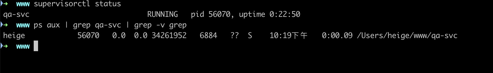
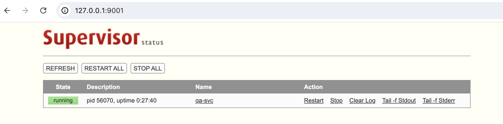
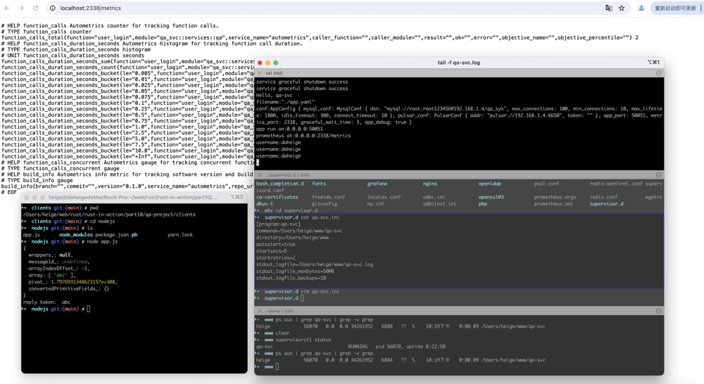

# macOS 安装supervisor
```shell
brew install supervisor
```
安装好supervisor后，配置文件在：/usr/local/etc/supervisord.conf
打开这个文件，跳到最后两行内容如下：
```ini
[include]
files = /usr/local/etc/supervisor.d/*.ini
```
从这个include块看出所有的应用程序启动的配置放在：/usr/local/etc/supervisor.d/*.ini

# 初始化 supervisor
1. 新建supervisor.d目录
```shell
mkdir -p /usr/local/etc/supervisor.d
```
2. 设置环境变量
vim ~/.bash_profile 添加如下内容：
```shell
export PATH="/usr/local/opt/supervisor/bin:$PATH"
```
执行 `source ~/.bash_profile` 生效

# 启动 supervisor
```shell
brew services start supervisor
```

# 部署应用程序
在/usr/local/etc/supervisor.d/目录下新增一个文件 qa-svc.ini ，内容如下：
```ini
# 使用supervisor启动
# /usr/local/etc/supervisor.d/qa-rpc.ini
[program:qa-svc]
command=/Users/heige/www/qa-svc
directory=/Users/heige/www
autostart=true
startsecs=5
startretries=2
stdout_logfile=/Users/heige/www/qa-svc.log
stdout_logfile_maxbytes=50MB
stdout_logfile_backups=10
```
保存退出后，执行 `supervisorctl update` 就会启动应用程序 qa-svc

# 查看supervisor状态
```shell
supervisorctl status
```
这个命令执行结果会列出正在运行的应用程序：
```
qa-svc                           RUNNING   pid 56070, uptime 0:19:06
```
通过`ps aux | grep qa-svc | grep -v grep`可以查看应用程序的状态
结果如下：


除了使用 supervisorctl 命令管理应用程序，你还可以在浏览器中访问 `http://127.0.0.1:9001/` 来管理应用程序


整个qa-svc运行效果如下图所示：


# supervisor 基本命令操作
```shell
#关闭所有任务
supervisorctl shutdown

# 启动某个进程
supervisorctl start qa-svc

# 重启某个进程
supervisorctl restart qa-svc

# 停止全部进程 注：start、restart、stop都不会载入最新的配置文件
supervisorctl stop all

# 载入最新的配置文件，停止原有进程并按新的配置启动、管理所有进程。
supervisorctl reload

# 根据最新的配置文件，启动新配置或有改动的进程，配置没有改动的进程不会受影响而重启。
supervisorctl update
```
