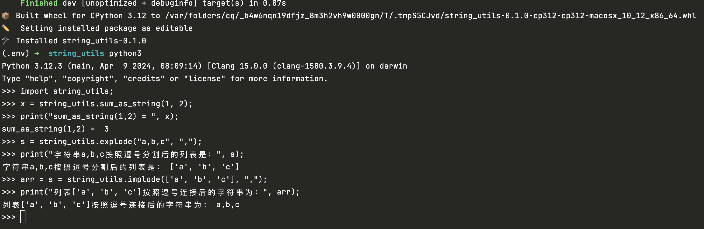
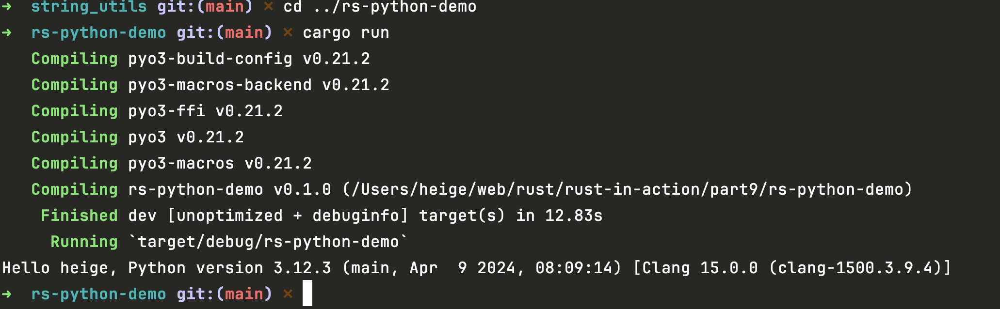

# pyo3库
https://github.com/PyO3/pyo3

# python虚拟环境安装

```shell
python3 -m venv .env
source .env/bin/activate
pip3 install maturin
```

# 项目构建

在安装好python虚拟环境后，就可以使用maturin工具编译rust library

```shell
maturin develop
```

运行该命令后，就会在.env/lib/python3.12/site-packages目录下生成一个python string_utils模块

# python虚拟环境退出

```shell
deactivate
```

# 运行python string_utils模块

```shell
cd python-project
python3 main.py
```

# 在python交互窗口中运行string_utils模块

```shell
python3 -m venv .env
source .env/bin/activate
pip3 install maturin
maturin develop
python3
```

在交互窗口中添加如下代码：

```python
# 引入string_utils包
import string_utils;

# 调用string_utils包提供的函数
x = string_utils.sum_as_string(1, 2);
print("sum_as_string(1,2) = ", x);

s = string_utils.explode("a,b,c", ",");
print("字符串a,b,c按照逗号分割后的列表是：", s);

arr = s = string_utils.implode(['a', 'b', 'c'], ",");
print("列表['a', 'b', 'c']按照逗号连接后的字符串为：", arr);
```

运行效果如下图所示：


# 在rust中调用python代码

```shell
cd ../rs-python-demo
cargo run
```

运行效果如下图所示：

